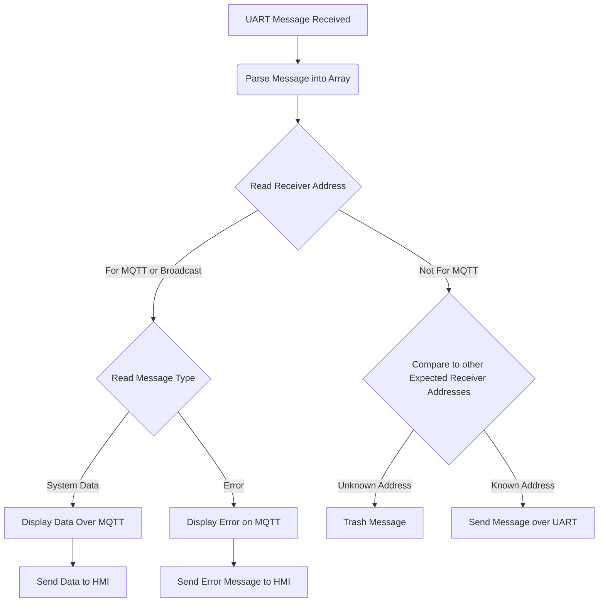
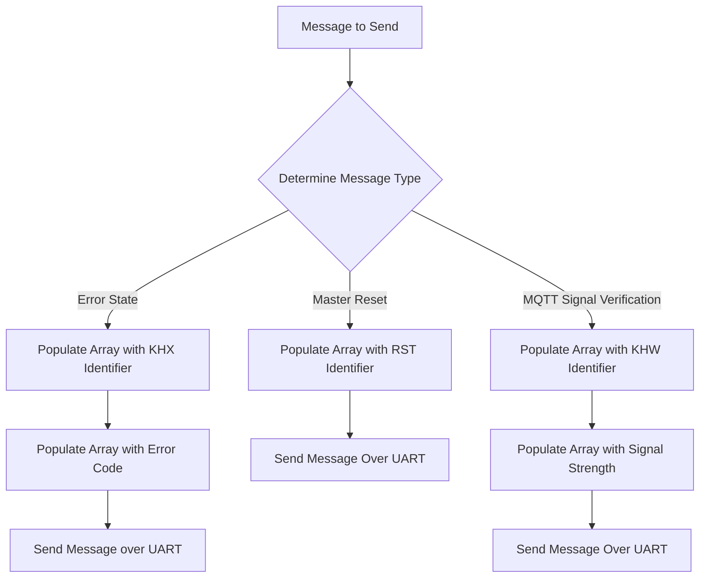

## Team Definitions

### Team Bytes

| Type |  Byte  |
| -----------| ----------- |
| Start | AZ  |
| Stop | YB |

### Team Addresses

| Name |  Address  |
| -----------| ----------- |
| Noah Brent | N  |
|Evan Skinner| E |
|Kirk Volin| K |
|Hunter Hassebroek| H |
| Broadcast | X| 

##### Bytes 1-3 in messages are used to declare the message type
##### Bytes 4 - n show message states/data
##### All messages are converted to UTF-8 for UART transmission

### MQTT Sent Messages
#### Message Type 14 - (Master System Reset)
##### Broadcast message from remote user to trigger reset on all systems

|  |  Byte 1: Sender     |  Byte 2: Receiver | Byte 3-5: Data Type | 
| -----------| ----------- | --| --| 
|Variable Name| MQTT_ID  | HMI_ID| masterReset |
|Variable Type| char  | char | char|
|Min| K  | X | RST |
|Max| K  | X | RST |
|Example| K | X | RST |

#### Message Type 13 - WiFi Signal Verification
##### Message sent to HMI to display WiFi connection 

|  |  Byte 1: Sender     |  Byte 2: Receiver | Byte 3: Data Type | Byte 4: Data |
| -----------| ----------- | -- | -- | -- |
|Variable Name| MQTT_ID  | HMI_ID | wifi_type | wifi_data |
|Variable Type| char  | char | char | uint8_t |
|Min| K  | H | W | 0 |
|Max| K  | H | W | 1 |
|Example| K | H | W | 1 |

#### Message Type 15 - MQTT Error State
##### Message sent to HMI to display error state in HMI

|  |  Byte 1: Sender     |  Byte 2: Receiver | Byte 3: Data Type | Byte 4: Data |
| -----------| ----------- | -- | -- | -- |
|Variable Name| MQTT_ID  | HMI_ID | error_type | error_data |
|Variable Type| char  | char | char | uint8_t |
|Min| K  | H | X | 0 |
|Max| K  | H | X | 5 |
|Example| K | H | X | 3 |

Error Types:

0: Not connected to WiFi  
1: Data Overflow Received  
2: Unknown Address Received  
3: Invalid Message Received  
4: No Communication Received (in a specified time range, ex. 1 minute)  

### MQTT Received Messages

#### Message Type 2, 14, 17 - System Information 
##### Sensor/Motor/HMI data to be displayed on MQTT

|  |  Byte 1: Sender     |  Byte 2: Receiver | Byte 3: Data Type | Byte 4: Data |
| -----------| ----------- | -- | -- | -- |
|Variable Name| ACTUATOR_ID  | MQTT_ID | data_type | wifi_data |
|Variable Type| char  | char | char | uint8_t |
|Min| N  | K | D | 0 |
|Max| N  | K | D | 3 |
|Example| N | K | D | 2 |

Actuator Data describes motor switching speeds in predefined settings

#### Message Type 3, 8, 20 - Subsystem Error 
##### Error State in a Specific Subsystem, displayed over MQTT for debugging purposes

|  |  Byte 1: Sender     |  Byte 2: Receiver | Byte 3-5: Error Type | Byte 6: Error Code |
| -----------| ----------- | -- | -- | -- |
|Variable Name| TEAM_ID  | BROADCAST_ID | error_type | wifi_data |
|Variable Type| char  | char | char | uint8_t |
|Min| A  | X | ERR | 0 |
|Max| Z  | X | ERR | 20 |
|Example| E | X | ERR | 5 |

Error type received is specified in the subsystem that sent the error message.  

### Message Handling Process Flow (Received)

### Message Handling Process Flow (Sent)

