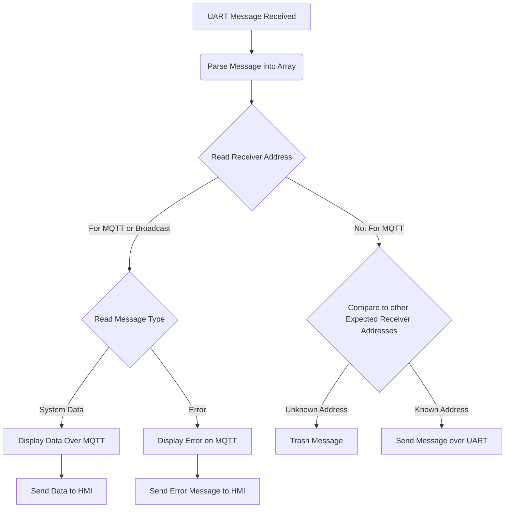
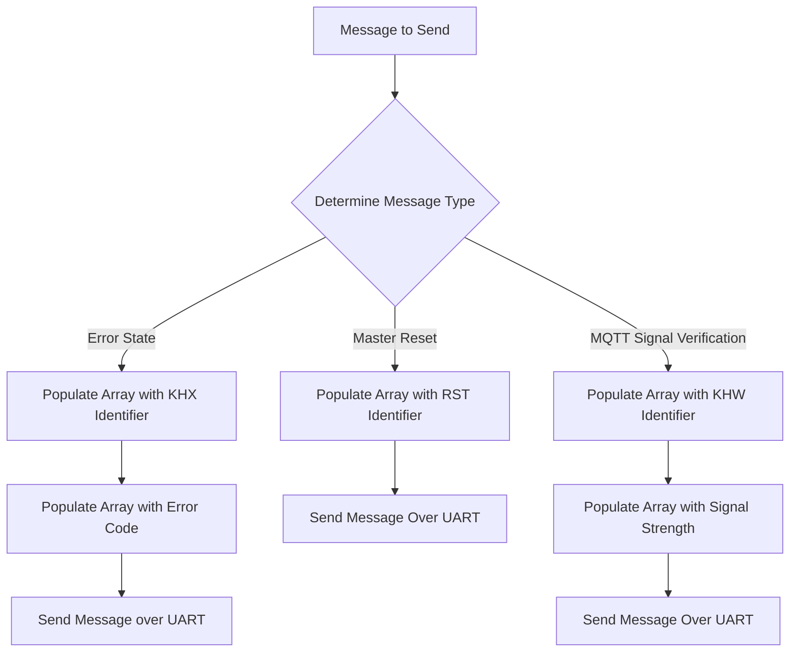

## Team Definitions

### Team Bytes

| Type |  Byte  |
| -----------| ----------- |
| Start | AZ  |
| Stop | YB |

### Team Addresses

| Name |  Address  |
| -----------| ----------- |
| Noah Brent | N  |
|Evan Skinner| E |
|Kirk Volin| K |
|Hunter Hassebroek| H |
| Broadcast | X| 

### Message Formatting 
##### Excluding Prefix and Suffix (Start and Stop)

##### Byte 1: Sender Address
##### Byte 2: Receiver Address
##### Byte 3: Data Type
##### Bytes 4: Data
##### All messages are converted to UTF-8 for UART transmission

### MQTT Sent Messages
#### Message Type 14 - (Master System Reset)
- Broadcast message from remote user on MQTT to trigger reset on the system. 
- If RST is sent to the MQTT SUB,  it will trigger this static message to reset all subsystems.

|  |  Byte 1: Sender     |  Byte 2: Receiver | Byte 3: Data Type | Byte 4: Data  
| -----------| ----------- | --| --| -- |
|Variable Name| MQTT_ID  | BROADCAST_ID| masterReset | resetState
|Variable Type| char  | char | char| uint8_t | 
|Min| K  | X | R | 1
|Max| K  | X | R |1
|Example| K | X | R | 1

#### Message Type 13 - WiFi Signal Verification
- Message sent to HMI to display WiFi connection state.
- A received state of 0 indicates no connection
- A state of 1 indicates a stable WiFi connection

|  |  Byte 1: Sender     |  Byte 2: Receiver | Byte 3: Data Type | Byte 4: Data |
| -----------| ----------- | -- | -- | -- |
|Variable Name| MQTT_ID  | HMI_ID | wifi_type | wifi_data |
|Variable Type| char  | char | char | uint8_t |
|Min| K  | H | W | 0 |
|Max| K  | H | W | 1 |
|Example| K | H | W | 1 |

#### Message Type 15 - MQTT Error State
##### Message sent to HMI to display error state in HMI

|  |  Byte 1: Sender     |  Byte 2: Receiver | Byte 3: Data Type | Byte 4: Data |
| -----------| ----------- | -- | -- | -- |
|Variable Name| MQTT_ID  | HMI_ID | error_type | error_code |
|Variable Type| char  | char | char | uint8_t |
|Min| K  | H | F | 1 |
|Max| K  | H | F | 9 |
|Example| K | H | F | 3 |

Error Types:

0: Unknown Error Occurred Handling MQTT Message - Check Terminal for Further Details
1: Invalid Sender ID  
2: Invalid Receiver ID  
3: Unexpected Message Type Sent to MQTT ID  
4: Unknown Error Handling UART Message - Check Terminal for Further Details  
5: Unexpected Message Type Sent to Broadcast ID  
6: Max Message Length Exceeded, Prefix Detected
7: Max Message Length Exceeded Without Prefix Detected  
8: Invalid Command Received over MQTT  
9: Invalid Message Length Received from MQTT (3 Characters Expected)    
A: Data Message Out of Expected Range

### MQTT Received Messages

#### Message Type 2, 14, 17 - System Information 
##### Sensor/Motor/HMI data to be displayed on MQTT

|  |  Byte 1: Sender     |  Byte 2: Receiver | Byte 3: Data Type | Byte 4: Data |
| -----------| ----------- | -- | -- | -- |
|Variable Name| ACTUATOR_ID  | MQTT_ID | data_type | wifi_data |
|Variable Type| char  | char | char | uint8_t |
|Min| N  | K | D | 0 |
|Max| N  | K | D | 3 |
|Example| N | K | D | 2 |

Actuator Data describes motor switching speeds in predefined settings
- MQTT will update with this data then forward the message to the HMI subsystem

#### Message Type 3, 8, 20 - Subsystem Error 
##### Error State in a Specific Subsystem, displayed over MQTT for debugging purposes

|  |  Byte 1: Sender     |  Byte 2: Receiver | Byte 3-5: Error Type | Byte 6: Error Code |
| -----------| ----------- | -- | -- | -- |
|Variable Name| TEAM_ID  | BROADCAST_ID | error_type | error_code |
|Variable Type| char  | char | char | uint8_t |
|Min| A  | X | F | 0 |
|Max| Z  | X | F | 9 |
|Example| E | X | F | 5 |

- Error type received is specified in the subsystem that sent the error message.  

### Message Handling Process Flow (Received)

### Message Handling Process Flow (Sent)

