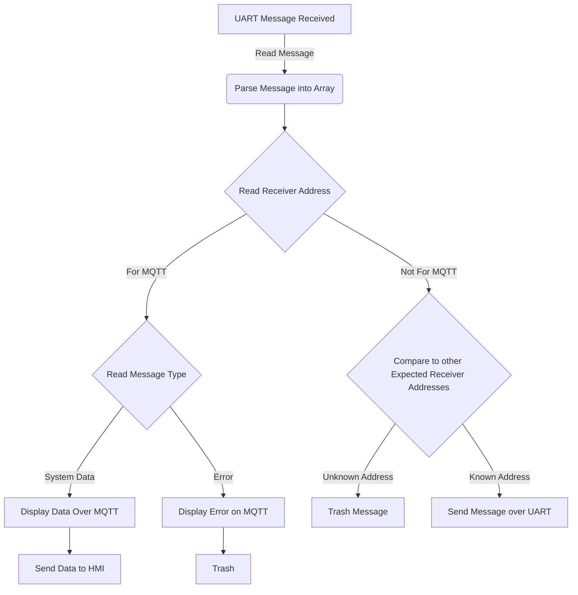
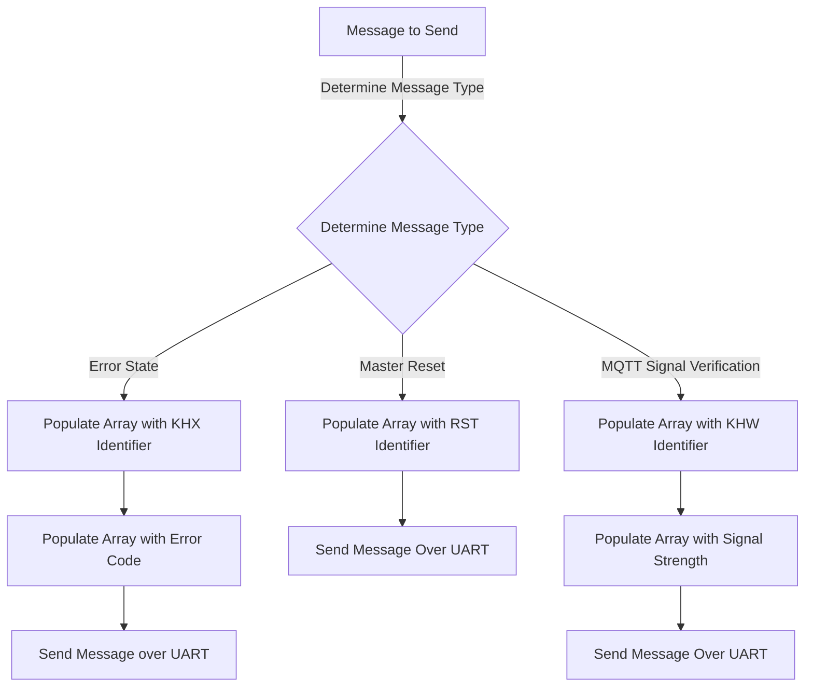

## Team Definitions

### Team Bytes

| Type |  Byte  |
| -----------| ----------- |
| Start | AZ  |
| Stop | YB |

### Team Addresses

| Name |  Address  |
| -----------| ----------- |
| Noah Brent | N  |
|Evan Skinner| E |
|Kirk Volin| K |
|Hunter Hassebroek| H |
| Broadcast | X| 

##### Bytes 1-3 in messages are used to declare the message type
##### Bytes 4 - n show message states/data

### MQTT Sent Messages
#### Message Type 14 - (Master System Reset)
##### Broadcast message from remote user to trigger reset on all systems

|  |  Byte 1-3     |  
| -----------| ----------- | 
|Variable Name| masterReset  | 
|Variable Type| char  | uint8_t |
|Min| RST  | 
|Max| RST  | 
|Example| RST |

#### Message Type 13 - MQTT Signal Verification
##### Message sent to HMI to display MQTT signal quality

|  |  Byte 1 - 3    |  Byte 4 |
| -----------| ----------- | -- |
|Variable Name| mqttSignal  | signalStrength |
|Variable Type| char  | uint8_t | 
|Min| KHW | 0  |
|Max| KHW |  100 | 
|Example| KHW | 34 |  

#### Message Type 15 - MQTT Error State
##### Message sent to HMI to display error state in HMI

|  |  Byte 1 - 3     | Byte 4| 
| -----------| ----------- | -- |
|Variable Name| mqttError  | errorValue |
|Variable Type| char  | uint8_t |
|Min | KHX  | 0 |
|Max | KHX | 5 |
|Example| KHX |  3 |

Error Types:

0: Not connected to WiFi  
1: Data Overflow Received  
2: Unknown Address Received  
3: Invalid Message Received  
4: No Communication Received (in a specified time range, ex. 1 minute)  

### MQTT Received Messages

#### Message Type 2, 14, 17 - System Information 
##### Sensor/Motor/HMI data to be displayed on MQTT

|  |  Byte 1     | Byte 2 | 
| -----------| ----------- | -- | 
|Variable Name| data  | Motor_Speed   | 
|Variable Type| char  |  uint8_t   | 
|Min| NKD  |  0  |   
|Max| NKD |  3   |   
|Example| NKD |   2   |  

HMI Data includes user's inputted control value
Motor Data includes motor switching speeds
Sensor Data includes sensor trigger speeds

#### Message Type 3, 8, 20 - Subsystem Error 
##### Error State in a Specific Subsystem, displayed over MQTT for debugging purposes

|  |  Byte 1 - 3    | Byte 4 | Byte 5 |
| -----------| ----------- | -- | -- |
|Variable Name| Error  | Error_Address   | Error_Message  |
|Variable Type| char  |  char   | uint8_t   |
|Min| ERR  |  A  | 0  |
|Max| ERR |  Z   |  30 |
|Example| ERR |   H   |  5 |

Error type received is specified in the subsystem that sent the error message.  

### Message Handling Process Flow (Received)

### Message Handling Process Flow (Sent)

